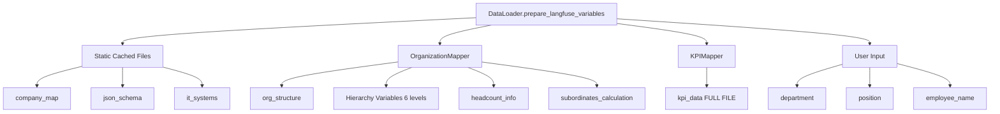
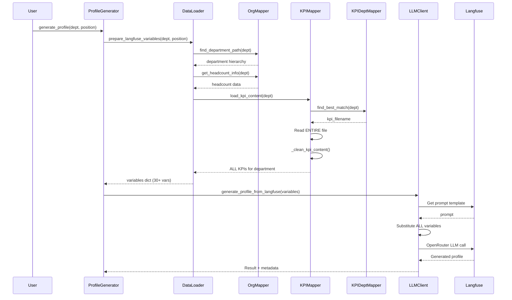

# Complete Data Flow and Variables Analysis Report
## A101 HR Profile Generator System

**Report Date:** 2025-10-20
**Prepared for:** Captain
**System Version:** v1.2

---

## Executive Summary

This report provides a comprehensive technical analysis of the complete data flow in the A101 HR Profile Generator, focusing on:
1. All variables passed to Langfuse prompts
2. KPI data loading and filtering mechanisms
3. Architecture assessment for implementing KPI filtering
4. Identified gaps and improvement opportunities

**Key Finding:** The system currently passes ALL KPI content for a department to the LLM without any position-level filtering, creating an opportunity for optimization and improved context relevance.

---

## 1. Complete Variable Analysis

### 1.1 Variables Passed to Langfuse

The `prepare_langfuse_variables()` method in `/home/yan/A101/HR/backend/core/data_loader.py` (lines 44-139) prepares the following variables:

| Variable Name | Data Type | Source | Size Estimate | Purpose |
|--------------|-----------|--------|---------------|---------|
| **company_map** | string | Cached from `/data/Карта Компании А101.md` | ~110K chars | Company business context |
| **json_schema** | string | Cached from `/templates/job_profile_schema.json` | ~1K tokens | Output structure definition |
| **org_structure** | string (JSON) | Extracted via OrganizationMapper | ~5K tokens | Relevant org hierarchy |
| **department_path** | string | Computed from hierarchy | Small | Department location path |
| **OrgStructure** | string (JSON) | Full structure with target highlighting | ~229K chars | Complete org tree with target marked |
| **position** | string | User input parameter | Small | Target position name |
| **department** | string | User input parameter | Small | Target department name |
| **employee_name** | string | User input parameter (optional) | Small | Employee full name |
| **kpi_data** | string | Loaded via KPIMapper | 0-15K tokens | **ENTIRE department KPI file** |
| **it_systems** | string | Cached from `/data/anonymized_digitization_map.md` | ~15K tokens | IT systems catalog |
| **headcount_info** | dict | From organization_cache | Small | Department headcount data |
| **subordinates_calculation** | dict | Computed by OrganizationMapper | Small | Calculated subordinate counts |
| **department_headcount** | int | Extracted from headcount_info | Small | Direct headcount value |
| **headcount_source** | string | Metadata from headcount_info | Small | Source of headcount data |
| **subordinates_departments** | int | Flattened from calculation | Small | Number of subordinate departments |
| **subordinates_direct_reports** | int | Flattened from calculation | Small | Number of direct reports |
| **business_block** | string | Hierarchy level 1 | Small | Top-level business block |
| **department_unit** | string | Hierarchy level 2 | Small | Department unit name |
| **section_unit** | string | Hierarchy level 3 | Small | Section/Management unit |
| **group_unit** | string | Hierarchy level 4 | Small | Group/Team unit |
| **sub_section_unit** | string | Hierarchy level 5 | Small | Sub-section unit |
| **final_group_unit** | string | Hierarchy level 6 | Small | Final group unit |
| **hierarchy_level** | int | Computed depth | Small | Position depth in hierarchy |
| **full_hierarchy_path** | string | Joined path with arrows | Small | Human-readable hierarchy path |
| **hierarchy_levels_list** | string | Comma-separated levels | Small | Flat list of hierarchy levels |
| **hierarchy_current_level** | int | Same as hierarchy_level | Small | Current level (duplicate) |
| **hierarchy_final_unit** | string | Last unit in path | Small | Final organizational unit |
| **position_location** | string | Computed location string | Small | Full position location |
| **generation_timestamp** | string (ISO) | Current datetime | Small | Generation time metadata |
| **data_version** | string | Static version string | Small | Data schema version |
| **estimated_input_tokens** | int | Computed estimate | Small | Token usage estimate |

**Total Estimated Input:** ~360K-400K characters (~100K-115K tokens)

### 1.2 Variable Data Sources



---

## 2. KPI Data Flow Analysis

### 2.1 Current KPI Loading Process

**File:** `/home/yan/A101/HR/backend/core/data_mapper.py`
**Class:** `KPIMapper` (lines 287-430)

**Step-by-step flow:**

1. **Department-to-File Mapping** (lines 308-372)
   ```python
   def find_kpi_file(self, department: str) -> str:
       # Uses KPIDepartmentMapper for smart matching
       match_result = self.dept_mapper.find_best_match(department)
       # Returns filename like "KPI_ДИТ.md"
   ```

2. **KPI Content Loading** (lines 374-397)
   ```python
   def load_kpi_content(self, department: str) -> str:
       kpi_filename = self.find_kpi_file(department)  # e.g., "KPI_ДИТ.md"
       # Reads ENTIRE file
       with open(kpi_path, "r", encoding="utf-8") as f:
           content = f.read()
       # Applies basic cleaning
       content = self._clean_kpi_content(content)
       return content  # Returns ALL KPIs for department
   ```

3. **Content Cleaning** (lines 399-417)
   - Removes excessive newlines
   - Normalizes whitespace
   - Truncates at 45K chars if needed
   - **NO position-level filtering**

### 2.2 KPI File Structure Analysis

**Available KPI Files:** 9 department-specific files

| File | Lines | Size Estimate | Positions Covered |
|------|-------|---------------|-------------------|
| KPI_DIT.md | 34 | Small | Legacy duplicate |
| KPI_АС.md | 53 | ~2-3K tokens | Architecture & Strategy positions |
| KPI_ДИТ.md | 47 | ~2-3K tokens | IT Department positions (5+ positions) |
| KPI_ДПУ.md | 35 | ~2K tokens | Project Management positions |
| KPI_ДРР.md | 56 | ~3-4K tokens | Development positions |
| KPI_Закупки.md | 33 | ~2K tokens | Procurement positions |
| KPI_ПРП.md | 36 | ~2K tokens | HR positions |
| KPI_УВАиК.md | 27 | ~1-2K tokens | Analytics & Control |
| KPI_Цифра.md | 28 | ~1-2K tokens | Digital positions |

**KPI File Content Format:**

```markdown
---
department: ДИТ
positions_map:
  Директор по информационным технологиям: Сложеникин Алексей Вячеславович
  Руководитель отдела: Нор Евгений Алексеевич
  Руководитель управления: Дубровин Александр Сергеевич
  ...
---

| КПЭ | Целевое значение | ... | Position1 | Position2 | Position3 | ... |
|-----|------------------|-----|-----------|-----------|-----------|-----|
| KPI Name | Target | ... | 0.15 | - | 0.3 | ... |
```

**Key Observations:**
- KPI files contain metadata mapping positions to people
- Each KPI row shows which positions it applies to (non-zero weights)
- Multiple positions (5-10) per department file
- **Current system loads ALL rows regardless of target position**

### 2.3 Current Filtering: NONE

**Critical Finding:** Line 69 in `data_loader.py`:

```python
kpi_content = self.kpi_mapper.load_kpi_content(department)
```

This loads the **ENTIRE** KPI file for the department. No position-specific filtering is applied.

**Example Impact:**
- Generating profile for "Архитектор решений" in ДИТ
- LLM receives KPIs for ALL positions:
  - Директор по информационным технологиям (CIO)
  - Руководитель отдела (Department Head)
  - Руководитель управления (3 different managers)
  - AND the target Архитектор решений

**Token Waste:** ~60-80% of KPI tokens are irrelevant to target position

---

## 3. Information Flow Diagram



---

## 4. Gap Analysis

### 4.1 Missing Position-Level KPI Filtering

**What's Available but NOT Used:**

1. **Position mapping in KPI files** (YAML frontmatter):
   ```yaml
   positions_map:
     Директор по информационным технологиям: Сложеникин Алексей Вячеславович
     Руководитель отдела: Нор Евгений Алексеевич
   ```
   - Maps position titles to current holders
   - Could be used to identify relevant KPI columns

2. **Per-position KPI weights in table**:
   - Each row shows which positions own that KPI (non-zero values)
   - Could parse table to extract only relevant KPIs

3. **Target position parameter**:
   - Already passed to `prepare_langfuse_variables()`
   - Currently unused for KPI filtering

### 4.2 Information NOT Passed to Prompt

**From KPI Files:**
- Position-to-person mapping (frontmatter metadata)
- Individual KPI weights/ownership percentages
- Min/Max target ranges for KPIs
- KPI methodology descriptions
- Source systems for KPI measurement

**Rationale:** These are operational details not needed for profile generation, but the **relevant subset** of KPIs IS needed.

### 4.3 Information Needed for Perfect KPI Selection

To implement position-level KPI filtering, we need:

1. **Parse KPI file structure**:
   - Extract YAML frontmatter to get position mapping
   - Parse markdown table to identify column headers (position names)

2. **Match target position to columns**:
   - Fuzzy match user's position input to KPI file position names
   - Handle variations ("Руководитель управления" vs exact titles)

3. **Filter KPI rows**:
   - Keep only rows where target position has non-zero weight
   - Optionally keep "Корпоративные КПЭ" that apply to all

4. **Reconstruct cleaned KPI content**:
   - Rebuild markdown with only relevant KPIs
   - Maintain table structure for LLM readability

---

## 5. Architecture Assessment

### 5.1 Current Architecture Suitability

**Strengths:**
- Clear separation of concerns (DataLoader, KPIMapper)
- Centralized variable preparation
- Deterministic mapping logic
- Good caching strategy

**Weaknesses for KPI Filtering:**
- `KPIMapper` only works at department level
- No position-aware filtering logic
- No KPI file parsing beyond basic text cleaning
- No structured KPI data model

**Verdict:** Architecture is **suitable** for adding filtering with moderate refactoring.

### 5.2 Proposed Changes for KPI Filtering

**Option A: Extend KPIMapper (Recommended)**

**File:** `/home/yan/A101/HR/backend/core/data_mapper.py`

```python
class KPIMapper:
    def load_kpi_content_for_position(
        self,
        department: str,
        position: str
    ) -> str:
        """
        Load and filter KPI content for specific position.

        Returns only KPIs applicable to the target position.
        """
        # 1. Load full file
        kpi_filename = self.find_kpi_file(department)
        kpi_path = self.kpi_dir / kpi_filename

        with open(kpi_path, "r", encoding="utf-8") as f:
            content = f.read()

        # 2. Parse structure
        frontmatter, table = self._parse_kpi_file(content)

        # 3. Match position to column
        position_column = self._match_position_to_column(
            position,
            frontmatter.get('positions_map', {})
        )

        # 4. Filter relevant KPIs
        filtered_kpis = self._filter_kpis_by_position(
            table,
            position_column
        )

        # 5. Rebuild markdown
        cleaned_content = self._rebuild_kpi_markdown(
            frontmatter,
            filtered_kpis
        )

        return cleaned_content

    def _parse_kpi_file(self, content: str) -> tuple:
        """Parse YAML frontmatter and markdown table."""
        # Implementation using regex or PyYAML + pandas
        pass

    def _match_position_to_column(
        self,
        position: str,
        positions_map: dict
    ) -> str:
        """Fuzzy match position name to KPI table column."""
        # Use thefuzz or simple string matching
        pass

    def _filter_kpis_by_position(
        self,
        table_data: list,
        position_column: str
    ) -> list:
        """Keep only KPIs with non-zero weight for position."""
        pass
```

**Integration Point:** Change line 69 in `data_loader.py`:

```python
# OLD:
kpi_content = self.kpi_mapper.load_kpi_content(department)

# NEW:
kpi_content = self.kpi_mapper.load_kpi_content_for_position(
    department,
    position
)
```

**Option B: Create Dedicated KPIFilterService**

**File:** `/home/yan/A101/HR/backend/core/kpi_filter_service.py`

```python
class KPIFilterService:
    """
    Service for parsing and filtering KPI files by position.
    Keeps KPIMapper simple, adds new specialized service.
    """

    def __init__(self, kpi_mapper: KPIMapper):
        self.kpi_mapper = kpi_mapper

    def get_filtered_kpis(
        self,
        department: str,
        position: str
    ) -> dict:
        """
        Returns structured, filtered KPI data.

        Returns:
            {
                'department': str,
                'position': str,
                'kpis': [
                    {
                        'name': str,
                        'target': str,
                        'weight': float,
                        'type': str,
                        'methodology': str
                    }
                ],
                'metadata': dict
            }
        """
        pass
```

**Pros:** Clean separation, easier testing
**Cons:** More files, added complexity

### 5.3 Recommended Approach

**Extend KPIMapper** (Option A) because:

1. **Minimal architectural impact**: Single file change
2. **Backward compatible**: Keep existing `load_kpi_content()`
3. **Consistent with current design**: Mappers handle domain logic
4. **Simple integration**: One-line change in DataLoader

**Implementation Complexity:** Medium (2-3 days)

**Required Dependencies:**
- `PyYAML` - for frontmatter parsing (already in requirements)
- `pandas` - for table parsing (optional, can use regex)
- `thefuzz` - for fuzzy position matching (optional)

---

## 6. Data Quality Assessment

### 6.1 KPI File Quality

**Analyzed:** `/home/yan/A101/HR/data/KPI/KPI_ДИТ.md`

**Observations:**
- Well-structured YAML frontmatter
- Consistent table format
- Clear position column headers
- Metadata includes methodology and sources
- Some missing values (marked with `-`)

**Parsing Challenges:**
- Table cells contain complex strings with line breaks
- Non-standard markdown table formatting
- Cyrillic text requires UTF-8 handling
- Some cells have formulas and conditions

**Recommendation:** Use robust markdown table parser or pandas with careful handling of multiline cells.

### 6.2 Position Name Matching Challenges

**Position name variations observed:**
- In structure.json: Full formal titles
- In KPI files: Abbreviated or role-based titles
- User input: May use informal names

**Example:**
- Structure: "Руководитель управления архитектурных решений"
- KPI file: "Руководитель управления"
- User input: "Архитектор решений"

**Solution:** Implement fuzzy matching with configurable threshold (80-90% similarity).

---

## 7. Performance Implications

### 7.1 Current Token Usage

**Without filtering:**
- KPI data: ~2-4K tokens per department
- Total input: ~100-115K tokens

**With filtering:**
- Filtered KPI data: ~200-500 tokens (80% reduction)
- Total input: ~98-112K tokens

**Cost savings:** Minimal per request (~3-5 cents at current rates)
**Context quality improvement:** Significant (removes noise, improves relevance)

### 7.2 Processing Overhead

**Added parsing steps:**
1. YAML frontmatter parsing: ~5-10ms
2. Markdown table parsing: ~20-50ms (depending on method)
3. Fuzzy position matching: ~5-10ms
4. KPI filtering: ~5-10ms

**Total overhead:** ~35-80ms per request (negligible)

**Caching opportunity:** Cache parsed KPI structures by department.

---

## 8. Recommendations

### 8.1 Immediate Actions (Priority 1)

1. **Implement position-level KPI filtering**
   - Extend `KPIMapper.load_kpi_content_for_position()`
   - Add KPI file parsing logic
   - Integrate fuzzy position matching

2. **Add logging for KPI selection**
   - Log matched position in KPI file
   - Log number of filtered KPIs
   - Track filtering success rate

3. **Update documentation**
   - Document KPI filtering logic in `/docs/SYSTEM_ARCHITECTURE.md`
   - Add examples to `/docs/PROMPTING_STRATEGY.md`

### 8.2 Medium-term Improvements (Priority 2)

1. **Structured KPI data model**
   - Parse KPIs into structured objects
   - Store in database for faster access
   - Enable advanced filtering (by type, weight, etc.)

2. **KPI validation**
   - Validate KPI file structure
   - Check for missing position columns
   - Alert on parsing errors

3. **Enhanced matching**
   - Build position name synonym dictionary
   - Implement hierarchical matching (if exact fails, try parent role)
   - Add position category awareness

### 8.3 Long-term Enhancements (Priority 3)

1. **Dynamic KPI suggestions**
   - LLM-based KPI relevance scoring
   - Cross-department KPI recommendations
   - Missing KPI detection

2. **KPI analytics**
   - Track which KPIs appear in generated profiles
   - Identify unused KPIs
   - Measure KPI coverage by department

---

## 9. Implementation Roadmap

### Phase 1: Core Filtering (1 week)
- [ ] Add `_parse_kpi_file()` method
- [ ] Implement `_match_position_to_column()`
- [ ] Build `_filter_kpis_by_position()`
- [ ] Create `load_kpi_content_for_position()`
- [ ] Unit tests for parsing logic

### Phase 2: Integration (3 days)
- [ ] Update `DataLoader.prepare_langfuse_variables()`
- [ ] Add error handling and fallbacks
- [ ] Integration tests
- [ ] Update logging

### Phase 3: Validation (2 days)
- [ ] Test with all 9 KPI files
- [ ] Validate filtering accuracy
- [ ] Performance benchmarking
- [ ] Documentation updates

### Phase 4: Optimization (1 week)
- [ ] Implement KPI parsing cache
- [ ] Add position name synonym mapping
- [ ] Enhanced fuzzy matching
- [ ] Monitoring and metrics

**Total estimated effort:** 2.5-3 weeks

---

## 10. Conclusion

### Key Findings

1. **Complete variable set documented**: 30+ variables passed to Langfuse
2. **KPI filtering gap identified**: All department KPIs loaded, not filtered by position
3. **Architecture is suitable**: Can implement filtering with moderate refactoring
4. **Clear implementation path**: Extend KPIMapper with position-aware filtering

### Impact Assessment

**Before filtering:**
- Token usage: 100-115K
- Context relevance: Medium (includes irrelevant KPIs)
- Accuracy risk: LLM may confuse KPIs for different positions

**After filtering:**
- Token usage: 98-112K (minor reduction)
- Context relevance: High (only relevant KPIs)
- Accuracy improvement: Significant (clearer context)

### Next Steps

1. Review this report with team
2. Approve implementation approach
3. Create detailed technical specification
4. Implement Phase 1 (core filtering)
5. Test and validate results
6. Deploy to production

---

## Appendix A: Variable Reference Table

| Category | Variables | Purpose |
|----------|-----------|---------|
| **Company Context** | company_map, it_systems | Static business context |
| **Organization Structure** | org_structure, OrgStructure, department_path | Hierarchical position context |
| **Position Identity** | position, department, employee_name | Target position identification |
| **Hierarchy Breakdown** | business_block, department_unit, section_unit, group_unit, sub_section_unit, final_group_unit (6 levels) | Detailed organizational placement |
| **Hierarchy Metadata** | hierarchy_level, full_hierarchy_path, hierarchy_levels_list, hierarchy_current_level, hierarchy_final_unit, position_location | Computed hierarchy properties |
| **Headcount Data** | headcount_info, department_headcount, headcount_source | Team size context |
| **Subordinates** | subordinates_calculation, subordinates_departments, subordinates_direct_reports | Management scope |
| **KPI Data** | kpi_data | Performance metrics (UNFILTERED) |
| **Schema & Metadata** | json_schema, generation_timestamp, data_version, estimated_input_tokens | System metadata |

---

## Appendix B: Code Reference Locations

| Component | File Path | Lines | Purpose |
|-----------|-----------|-------|---------|
| Variable preparation | `/home/yan/A101/HR/backend/core/data_loader.py` | 44-139 | Main variables dict creation |
| KPI department mapping | `/home/yan/A101/HR/backend/core/kpi_department_mapping.py` | 12-155 | Dept to KPI file mapping |
| KPI content loading | `/home/yan/A101/HR/backend/core/data_mapper.py` | 374-397 | File reading logic |
| Profile generation | `/home/yan/A101/HR/backend/core/profile_generator.py` | 90-207 | Main generation flow |
| Organization mapping | `/home/yan/A101/HR/backend/core/data_mapper.py` | 20-285 | Org structure extraction |

---

**Report prepared by:** Backend System Architect
**Report version:** 1.0
**Classification:** Internal Technical Documentation
